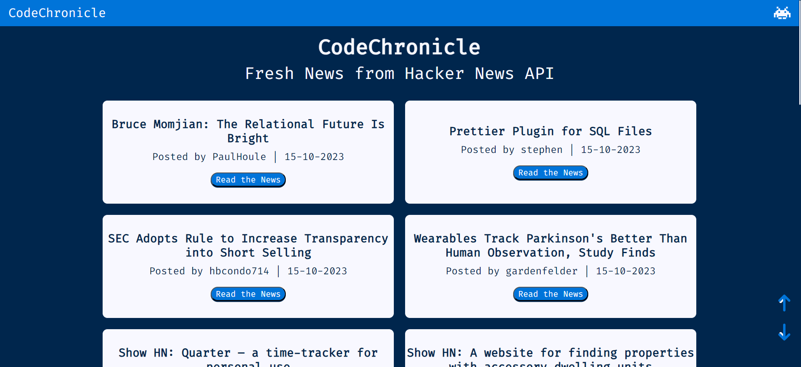
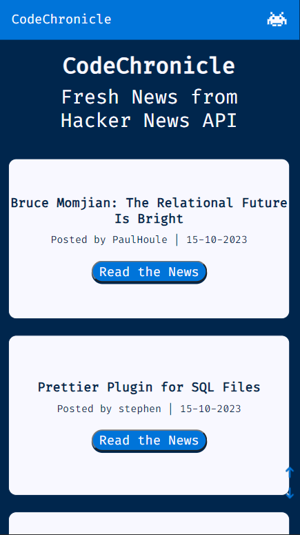

<h1 align="center">CodeChronicle</h1>

Fresh News from Hacker News
 
Click here to <a href="https://codechroniclenews.netlify.app"><strong>website</strong></a>

## Table of contents

- [Introduction to Project](#introduction-to-project)
  - [Requirements](#requirements)
- [Technologies](#technologies)
  - [Framework and libraries](#framework-and-libraries)
- [Usage](#usage)
- [Responsiveness](#responsiveness)
- [Author](#author)

## Introduction to Project

**CodeChronicle** born with the aim of creating an application for the dissemination of information in the technological field with the help of **Hacker News**, a website that acts as a news aggregator and discussion forum for technology enthusiasts.

### Requirements

At the startup, the website will contact the API from Hacker News service to show title,date and link of the latest available news. Given the large amount of data, in order to avoid performance problems, after having retrieved the list of the latest news, the application will only show the detail of the first 10 news. A button (**Load More**) must be implemented to allow the user to view information about the 10 next news.

## Technologies

  
  
  
  

### Frameworks and libraries

  
  
  
  
  

## Usage

At the startup you can see the firts 10 news from Hacker News, with title, who was post the news and when and with link to view the full news. If you want to see the next 10 news just click on **"Load More"** button. You can use the directional arrows to move around the page.

## Responsiveness

Thanks to the Bootstrap Container Layout and the use of Media Queries, I've manage to take care of the Responsiveness aspect of the website, which adapts perfectly to the change in the size of the device on which it is displayed.

## Author

Luca Cucinotta

  
  
  

